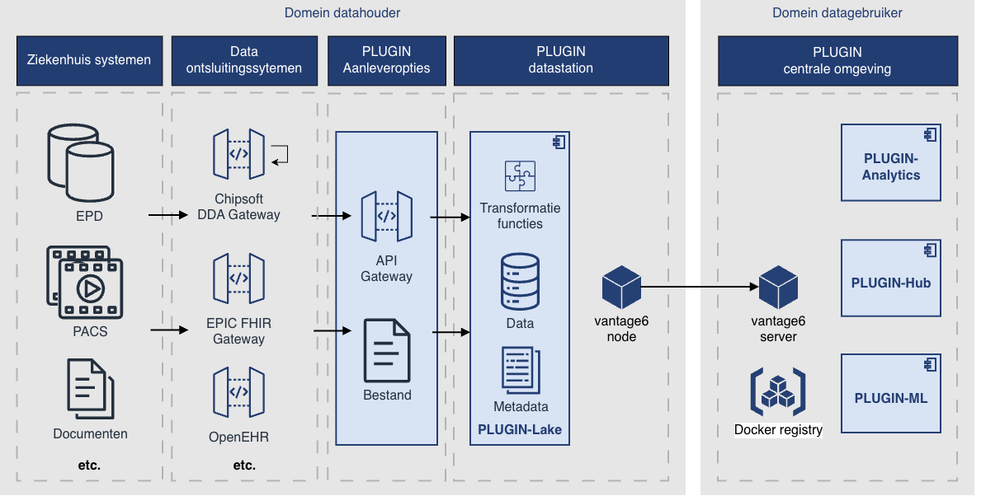

PLUGIN is modulair opgebouwd en bestaat daarmee uit verschillende componenten die hieronder schematisch zijn weergegeven. Een meer gedetailleerde toelichting staat beschreven in de handleiding en architectuur documentatie.

!!! abstract "Leeswijzer applicatie componenten"

    | Component | Omschrijving | Waar toegelicht |
    |:-----------|:------------|:----------------|
    | PLUGIN-Lake | Component waarmee het PLUGIN datastation wordt gevuld | Op deze pagina onder [...]()Handleiding met o.a. standaardovereenkomsten |
    | PLUGIN-Hub | Component waarmee gegevensaanleveringen kunnen worden uitgevoerd | Op deze pagina onder [...]() |
    | PLUGIN-Analytics | Component waarmee gegevensaanleveringen kunnen worden uitgevoerd | Op deze pagina onder [...]() |
    | PLUGIN-ML | Component waarmee federatief machine learning modellen ontwikkeld kunnen worden | Op deze pagina onder [...]() |
    | vantage6 node | Decentrale component van de vantage6 instructuur | Op deze pagina in de [vantage6 documentatie]() |
    | vantage6 server | Centrale processing hub van de vantage6 instructuur | Op deze pagina in de [vantage6 documentatie]() |
    | Docker register | Database van berekeningen die op het datastation mogen worden uitgevoerd | Op deze pagina in de [vantage6 documentatie]() |
