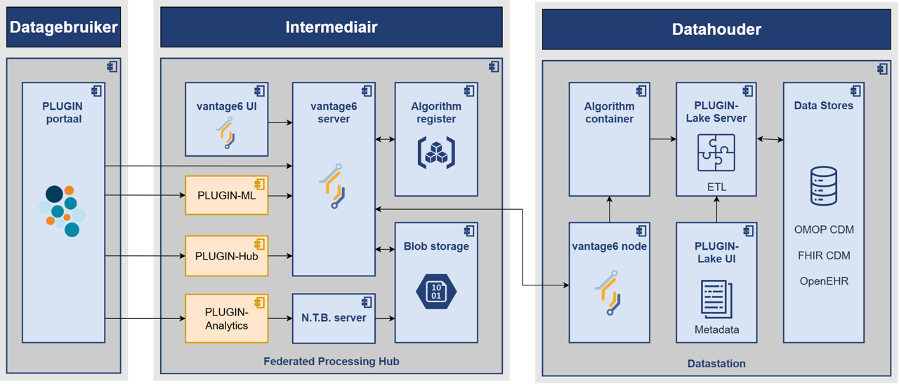

PLUGIN is modulair opgebouwd en bestaat daarmee uit verschillende componenten die hieronder schematisch zijn weergegeven. Een meer gedetailleerde toelichting staat beschreven in de handleiding en architectuur documentatie.

<likec4-view
   view-id="index"
   browser="true"
   dynamic-variant="sequence">
</likec4-view>

!!! abstract "Leeswijzer applicatie componenten"

    | Component | Omschrijving | Waar toegelicht |
    |:-----------|:------------|:----------------|
    | PLUGIN-ML | Component waarmee federatief machine learning modellen ontwikkeld kunnen worden | Op deze pagina onder [...]() |
    | PLUGIN-Hub | Component waarmee gegevensaanleveringen kunnen worden uitgevoerd | Op deze pagina onder [...]() |
    | PLUGIN-Analytics | Component waarmee federatieve analyses kunnen worden gefaciliteerd| Op deze pagina onder [...]() |
    | vantage6 server | Centrale processing hub van de vantage6 instructuur | Op deze pagina in de [vantage6 documentatie]() |
    | Algorithm register | Database van berekeningen die op het datastation mogen worden uitgevoerd | Op deze pagina in de [vantage6 documentatie]
    | Blob storage | Database van tussentijdse resultaten | Op deze pagina onder [...]() |
    | vantage6 node | Decentrale component van de vantage6 instructuur | Op deze pagina in de [vantage6 documentatie]() |
    | PLUGIN-Lake | Component waarmee het PLUGIN-datastation wordt gevuld en data geschikt wordt gemaakt voor hergebruik | Op deze pagina onder [...]() |

    () |
