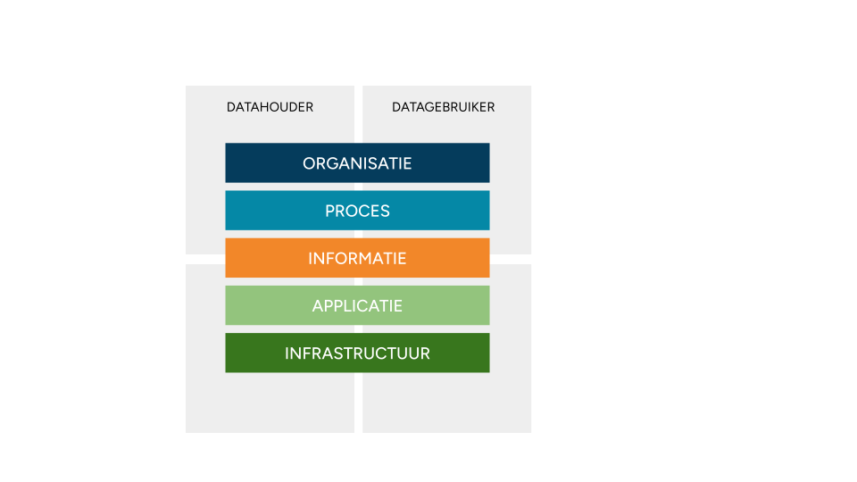

# PLUGIN ondersteunt datahouders in het veilig beschikbaar stellen van gezondheidsgegevens

Ziekenhuizen en andere datahouders staan voor een grote opgave om gezondheidsgegevens op grotere schaal beschikbaar te stellen voor hergebruik. De hoeveelheid gegevensverzoeken bij datahouders blijft onverminderd stijgen. Tegelijkertijd zien we dat veel van deze verzoeken of samenwerkingsverbanden allemaal een eigen infrastructuur nodig hebben. Dit terwijl de ontwikkelkalender van de IT-afdeling al overvol is. Er is daarom dringend behoefte om op een __open, gestandaardiseerde__ en __veilige__ manier data beschikbaar te stellen. Dit is wat PLUGIN biedt.

PLUGIN is verbonden aan Dutch Hospital Data (DHD) en brengt daarmee jarenlange ervaring met het implementeren en beheren van dataverwerkingsomgevingen voor de zorg. Het vernieuwende van PLUGIN is dat het sinds 2022 heeft gewerkt aan een landelijk dekkend, decentraal netwerk van zogenaamde datastations, waarmee hergebruik van gezondheidsgegevens op een betrouwbare en kosteneffectieve manier gerealiseerd kan worden. Per mei 2026 zijn ongeveer de helft van alle Nederlandse ziekenhuizen aangesloten op dit netwerk.

Wat PLUGIN kan betekenen voor datahouders wordt in de volgende pagina's uitgelegd. Daarbij wordt PLUGIN op vijf verschillende niveaus uitgelegd: organisatie, proces, informatie, applicatie en infrastructuur. We hebben leeswijzers opgesteld aan de hand van dit vijflagenmodel.

<figure markdown="span">
  
</figure>

!!! abstract "Vijflagenmodel"

    === "Organisatie"

        Beschrijving van de organisatorische kant van secundair gebruik: wie zijn er bij de samenwerking betrokken en hoe zijn verantwoordelijkheden en bevoegdheden gedefinieerd? Deze afspraken worden gemaakt op bestuurlijk niveau.
        
        Voorbeeld van standaarden op dit niveau zijn verwerkingsovereenkomsten waarbij een vertrouwde partij namens een datahouder een beveiligde verwerkingsomgeving aanbiedt.
        
    === "Proces"

        Dit niveau heeft betrekking op de procesmatige kant van secundair gebruik. Datagebruikers moeten gezondheidsgegevens kunnen vinden, een aanvraag kunnen indienen voor (her)gebruik, een analyse kunnen uitvoeren en de geanonimiseerde resultaten kunnen publiceren.
        
        Omdat secundair gebruik vaak meerdere datahouders betreft, zijn er processen waarbij de samenwerking, koppelvlakken e.d. zijn vastgesteld. Deze afspraken worden gemaakt met managers en mensen op de werkvloer.

    === "Informatie"

        Dit niveau heeft betrekking op de herbruikbaarheid van de gegevens. Voorbeelden van standaarden op dit niveau zijn terminologiestandaarden, classificaties en informatiestandaarden.

    === "Applicatie"

        Dit niveau heeft betrekking op de systemen en applicaties die secundair gebruik mogelijk maken. Het concept van een datastation en een processing hub zijn hierin centraal.

    === "Infrastructuur"

        Dit niveau heeft betrekking op de technische infrastructuur waarbinnen de systemen draaien, zoals het netwerk, de servers en de dataopslag. Het betreft de niet-zorgspecifieke ICT-componenten.

        Voorbeelden van standaarden op dit niveau zijn Linux en cloud storage.

- :lucide-building-2: __Organisatie__  [Lees meer :octicons-arrow-right-24:](./organisatie.md)
- :lucide-workflow: __Proces__  [Lees meer :octicons-arrow-right-24:](./proces.md)
- :lucide-library-big: __Informatie__  [Lees meer :octicons-arrow-right-24:](./informatie.md)
- :lucide-layout-grid: __Applicatie__  [Lees meer :octicons-arrow-right-24:](./applicatie.md)
- :lucide-cpu: __Infrastructuur__  [Lees meer :octicons-arrow-right-24:](./infrastructuur.md)

