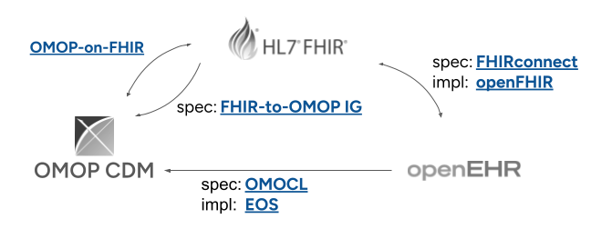

## Twee niveaus van interoperabiliteit

Het effectief en efficient hergebruik van gezondheidsgegevens staat of valt met het standaardiseren van de manier hoe datahouders informatie vastleggen. Hiertoe zal op twee niveaus interoperabiliteit moeten worden gerealiseerd.

-   :lucide-message-circle-code:{ .lg .middle } __Syntactische interoperabiliteit__

    ---
    
    
    Ten eerste is zogenaamde **syntactische interoperabiliteit** nodig. Dit gaat over de **vorm** en de **structuur** van het bericht, zoals bijvoorbeeld een brief.
    Syntactische interoperabiliteit betekent dat de ontvanger de brief fysiek kan openen, herkent dat het een brief is, en dat zij de letters kan lezen (bijvoorbeeld het Latijnse alfabet).

    !!! quote "Analogie"

        Ik stuur jou een zin die grammaticaal perfect klopt: "De blerf schrobt de grakker." De ontvanger kan de zin lezen (syntax is correct), maar heeft geen idee wat de verzender ermee bedoelt te zeggen.

-   :lucide-book-open-check:{ .lg .middle } __Semantische interoperabiliteit__

    ---

    Dit gaat over de **inhoud** en het **begrip**. Als de brief eenmaal is geopend, willen we begrijpen wat er staat.
    We moeten dezelfde taal spreken en dezelfde definities gebruiken. Als ik "bank" schrijf, moet de ontvanger weten of ik een zitmeubel bedoel of een geldinstelling.
    In de zorg maken we gebruik van landelijke codestelsels, zoals de DHD diagnose- en verrichtingenthesaurus, en internationale codestelsels zoals ICD-10, SNOMED CT en LOINC.

    !!! quote "Analogie"

        Om _"De blerf schrobt de grakker"_ te begrijpen, hebben we een woordenboek nodig dat uitlegt wat een _'blerf'_ is. Semantische interoperabiliteit zorgt ervoor dat de computer niet alleen "180" ziet staan, maar begrijpt dat dit een "bloeddruk" is in "mmHg".

## Syntactische interoperabiliteit: convergentie van de meest gebruikte informatiemodellen in de zorg

In de afgelopen jaar is de zorgsector aan het convergeren naar openEHR, OMOP en FHIR als de belangrijkste informatiemodellen:

- **FHIR (Fast Healthcare Interoperability Resources)** is een standaard dat met name geschikt is voor het **uitwisselen** van gezondheidsinformatie. Het is ontwikkeld door HL7 en maakt gebruik van moderne webtechnologieën en is ontworpen om flexibel en uitbreidbaar te zijn.
- **OMOP (Observational Medical Outcomes Partnership)** is een datamodel dat is ontwikkeld door de Observational Health Data Sciences and Informatics (OHDSI) gemeenschap. OMOP maakt gebruik van een gestandaardiseerde structuur en vocabulaire om gegevens te harmoniseren en te analyseren. Het is met name geschikt voor longitudinaal onderzoek en het uitvoeren van grootschalige analyses op gezondheidsgegevens.
- **openEHR** is een open standaard voor het modelleren en beheren van elektronische gezondheidsdossiers in bronsystemen. Het is ontwikkeld door de openEHR Foundation en is gericht op het faciliteren van interoperabiliteit en hergebruik van gezondheidsinformatie in het primaire proces.

Om syntactische interoperabiliteit tussen deze drie standaarden te realiseren, is het noodzakelijk om specificaties c.q. mappings op te stellen hoe elementen uit het ene informatiemodel vertaald moeten worden naar het andere. Idealiter staan deze formele mappingsspecificaties los van de specifieke implementatie van software om de mappings daadwerkelijk te realiseren, zoals in bovenstaand diagram is weergegeven. Ten tijde van het schrijven van dit document zijn de volgende (eerste versies van) formele mappingsspecificaties beschikbaar.

!!! abstract "Syntactische interoperabiliteit: beschikbare mappings"

    === "FHIRconnect"

        De [FHIRconnect Specificatie](https://sevkohler.github.io/FHIRconnect-spec/build/site/FHIRconnect/v1.0.0/index.html) gebruikt een Domain Specific Language (DSL) om mappings te definiëren. Het abstraheert de transformatielogica naar "Mapping Templates" die onafhankelijk zijn van de onderliggende programmeertaal.

    === "HL7 FHIR-OMOP IG"

        De [HL7 FHIR-OMOP Implementation Guide](https://build.fhir.org/ig/HL7/fhir-omop-ig/) heeft formele regels tussen de twee informatiemodellen opgesteld, waarmee het transactionele karakter (uitwisseling) van FHIR en het longitudinale karakter van OMOP zijn integreerd. Deze ontwikkeling is nog relatief nieuw en nog niet alle dataelementen zijn volledig gemapt.

    === "OMOCL"

        De [OMOP Conversion Language](https://www.sciencedirect.com/science/article/pii/S1532046423001582) is een domein-specifieke taal waarin mapping van openEHR archetypes zijn gemaakt naar het OMOP CDM. Het is het resultaat van ee onderzoeksproject en is in juli 2025 ter consultatie voorgelegd aan de openEHR community met als doel om het als formele specificatie te adopteren. EOS is de referentie implementatie van OMOCL.

    
PLUGIN zet actief in op de doorontwikkeling en gebruik van deze transformaties, waarbij we verschillende implementatiescenario's ondersteunen:

  1. Directe extractie vanuit het bronsysteem naar OMOP. Binnen PLUGIN hebben we hier ervaring mee opgedaan bij verschillende ziekenhuizen.
  2. Een bestaande FHIR representatie van de data naar OMOP, gebruik makend van de FHIR-OMOP IG.
  3. Een bestaande openEHR representatie van de data naar OMOP, gebruik makend van OMOCL.

## Semantische interoperabiliteit door integratie van thesauri en codestelsels
  
Het bereiken van semantische interoperabiliteit omvat verschillende stappen, waaronder:

Niet alle semantische interoperabiliteitsproblemen zijn even complex. Aan het ene kant van het spectrum bevinden zich generieke, breed gedeelde klinische gegevens — patiëntdemografie, diagnoses, medicatie, contacten, verrichtingen — waarvoor goed ingeburgerde standaarden (FHIR, OMOP CDM, SNOMED CT, LOINC, RxNorm) en steeds volwassener cross-model mappings al beschikbaar zijn. Aan het andere uiteinde bevinden zich zeer specifieke onderzoeksdomeinen — radiomics, multi-omics, gespecialiseerde biobankgegevens — waar minder consensus is over de gebruikte conceptuele modellen, codesystemen onvoldoende gedetaillerd zijn en het bereiken van semantische traceerbaarheid aanzienlijke inzet vereist van domein-experts.

In dit spectrum richt PLUGIN zich in eerste instantie op het faciliteren van mappings van de meest gebruikte - en minst complexe - data elementen. Dit doen met met name door uit de gaan van de meest gebruikte vocabulaires en ontologieën, zoals SNOMED CT, LOINC, RxNorm, DHD diagnose- en verrichtingenthesaurus, en door het ondersteunen van transformaties tussen deze vocabularies. Tegelijkertijd werken we aan het ontwikkelen van een aanpak voor het faciliteren van semantische interoperabiliteit in meer complexe domeinen, waarbij we gebruik maken van project-specifieke aanleveringen en domein-experts om de benodigde semantische lagen aan te brengen.

Voor deze meest gangbare klinische gegevens bestaat er al een groeiend ecosysteem van mappings, zowel in Nederland als internationaal. [SSSOM (Simple Standard for Sharing Ontology Mappings)](https://github.com/mapping-commons/sssom) gecombineerd met [SEMAPV (Semantic Mapping Vocabulary)](https://github.com/mapping-commons/semantic-mapping-vocabulary) biedt een gestandaardiseerd, machine-leesbaar formaat voor het vastleggen van deze mappings, inclusief hun herkomst, betrouwbaarheid en motivering. Bestaande mappings zouden met behulp van deze standaarden vastgelegd en onderhouden kunnen worden, bijvoorbeeld:

- DHD Diagnose- en Verrichtingenthesaurus — een Nederlandse ziekenhuiscoderingsthesaurus met potentieel voor gestandaardiseerde afstemming op ICD-10 en SNOMED CT.
- Z-Index naar RxNorm — het ErasmusMC heeft een mapping gemaakt van het Nederlandse Z-Index-geneesmiddelenregister naar RxNorm; Cornet et al. beschrijven de volledige keten van Z-Index → ATC → RxNorm.
- Mapping van 'vrije tekst' vocabulaires zoals [https://epilepsydiagnosis.org/](https://epilepsydiagnosis.org/) naar SNOMED CT.

## HealthDCAT AP als metadata standaard

Metadata speelt een cruciale rol in een datastation. Zonder goede metadata van de data weten onderzoekers en systemen niet welke data beschikbaar is, wat de kwaliteit ervan is, en onder welke voorwaarden deze gebruikt mag worden. Metadata maakt het mogelijk om:

- Datasets te vinden: Een onderzoeker kan in een catalogus zoeken naar datasets over hartfalen in een bepaalde leeftijdsgroep.
- Datasets te begrijpen: De beschrijving vertelt welke variabelen er zijn, hoe de data is verzameld, en welke beperkingen er gelden.
-Datasets automatisch te verwerken: Systemen kunnen op basis van gestandaardiseerde metadata beoordelen of een dataset geschikt is voor een bepaalde analyse.

Voor het realiseren van interoperabiliteit tussen datastations is het van groot belang dat metadata op een gestandaardiseerde manier wordt beschreven. Hiervoor zijn internationale standaarden en profielen ontwikkeld. PLUGIN gaat uit van HealthDCAT AP als metadata standaard.

!!! abstract "Metadata standaarden"

    === "DCAT"

        DCAT (Data Catalog Vocabulary) is een W3C-standaard die oorspronkelijk is ontworpen voor het beschrijven van datasets in datacatalogi. Het biedt een gemeenschappelijk vocabulaire waarmee organisaties hun datasets kunnen beschrijven, ongeacht het domein. DCAT versie 3 (2024) introduceert onder andere de `DatasetSeries` klasse voor het beschrijven van gerelateerde datasets.

    === "DCAT-AP"

        DCAT-AP is een Europees applicatieprofiel van DCAT, ontwikkeld door de Europese Commissie. Het verfijnt DCAT met extra verplichte en aanbevolen velden die relevant zijn voor Europese overheidsdata, zoals toegangsrechten en toepasselijke wetgeving. DCAT-AP vormt de basis voor veel nationale datacatalogi.

    
    === "HealthDCAT-AP"
    
        HealthDCAT-AP is een uitbreiding van DCAT-AP specifiek voor de gezondheidszorgsector. Het voegt metadata-elementen toe die essentieel zijn voor gezondheidsdata, zoals:
   
        - Gezondheidscategorieën (EHR, beelden, genomische data)
        - Populatiekenmerken (leeftijdsbereik, aantal unieke individuen)
        - Coderingssystemen (SNOMED CT, ICD-10, LOINC)
        - Retentieperiodes en bewaartermijnen
        - De verantwoordelijke Health Data Access Body (HDAB)     

!!! abstract "Leeswijzer informatie"

    === "Syntactische interoperabiliteit"

        | Onderdeel | Waar toegelicht |
        |:-----------|:----------------|
        | Gebruik van FHIR als logisch model | Op deze pagina onder [...]() |
        | Gebruik van OMOP als logisch model | Op deze pagina onder [...]() |
        | Transformaties tussen logische modellen | Op deze pagina onder [PLUGIN Lake]() |

    === "Semantische interoperabiliteit"

        | Onderdeel | Waar toegelicht |
        |:-----------|:----------------|
        | Gebruik van project-specifieke aanleveringen | Op deze pagina onder [AIOC aanlevering]() |
        | Gebruik van DHD diagnose- en verrichtingenthesaurus | Op deze pagina onder [DHD thesauri]() |
        | Gebruik van (inter)nationale codestelsels | Op deze pagina onder [codestelsels]() |
        | Transformaties tussen codestelsels | Op deze pagina onder [PLUGIN Lake]() |
