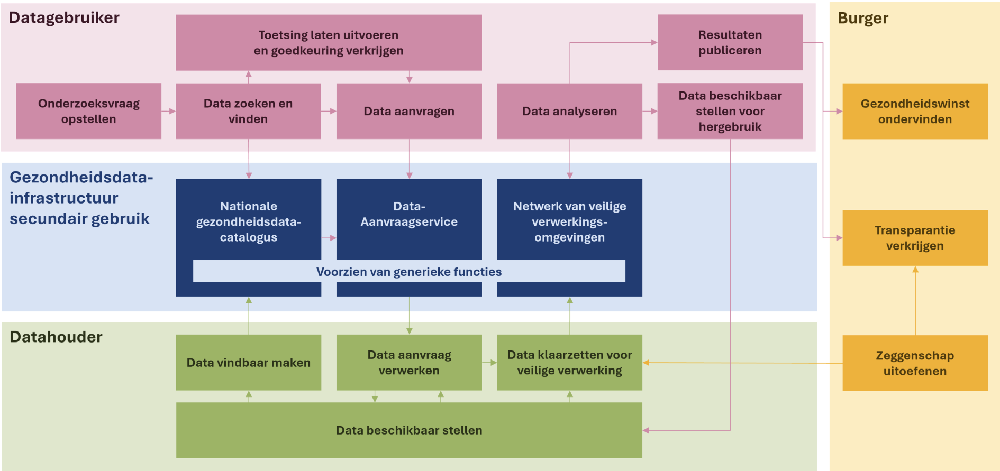

# 1. Inleiding en doelen

PLUGIN is een decentrale, hybride infrastructuur voor het ondersteunen van secundair gebruik van data in de zorg. Vanuit het principe van _security-by-design_ en het concept van de _Personal Health Train (PHT)_ maakt PLUGIN gebruik van zogenaamde datastations[^1] waarbij data lokaal bij de datahouders blijft maar toch kan worden gebruikt voor i) federatieve analyse, ii) federatief leren en iii) het gestandaardiseerd doorgeven van grote gegevenssets. Met deze generieke functionaliteit biedt PLUGIN een manier om uitvoering te geven aan twee soorten gegevensaanvragen die in de European Health Data Space (EHDS) zijn gedefinieerd, namelijk:

- Vergunning (_permit_): aanvragen voor toegang tot gezondheidsgegevens (artikel 68) waarbij de datagebruiker toegang tot de aangevraagde gezondheidsgegevens en deze kan gebruiken in een beveiligde verwerkingsomgeving (BVO), en 
- Gegevensverzoek (_request_): Verzoeken om geaggregeerde gezondheidsgegevens die niet meer herleidbaar zijn naar personen (artikel 69), waarbij de datagebruiker alleen eindresultaat krijgt van een voorafgedefinieerde statistische berekening (_query_) 

!!! abstract "Doelen"

    | Prioriteit | Doel |
    |:-----------|:-----|
    | 1 | **Datahouders** kunnen met PLUGIN op een betrouwbare, veilig, effectieve en efficiente manier hun data beschikbaar stellen voor secundair gebruik |
    | 1 | **Datagebruikers** kunnen met PLUGIN op een efficiente manier toegang krijgen tot data en op een gebruiksvriendelijke manier ermee werken voor secundair gebruik |
    | 2 | Samenwerkingverbanden ... |
    | 2 | Autoriteiten die toezien op secundair gebruik kunnen ... |

## 1.1. Functionele vereisten

Binnen het hele ecosysteem van van secundair gebruik ondersteund PLUGIN specifieke usecases (processtappen) voor datahouders en datagebruikers.

!!! abstract "Usecases per doelgroep"

    === "Datahouder"

        - Data beschikbaar stellen
        - Data vindbaar maken
        - Data aanvraag verwerken
        - Data klaarzetten voor veilige verwerking

    === "Datagebruiker"

        - Data analyseren
        
        De andere usecases voor de datagebruiker worden binnen het ecosysteem van secundair gebruik ingevuld door andere partijen/systemen.

## 1.2. Kwaliteitseisen

PLUGIN geeft invulling aan de functionele vereisten voor een data space voor secundair gebruik van gezondheidsgegevens. In de ontwikkeling van PLUGIN wordt expliciet rekening gehouden met de TEHDAS2[^2] richtlijnen zodat het voldoet aan standaarden voor kwaliteit, veiligheid en interoperabiliteit. PLUGIN streeft ernaar om op termijn te voldoen aan alle (kwaliteits)eisen zoals in de TEHDAS2 consultatie zijn geformuleerd.[^3]

??? abstract "Vereisten voor gevoelige data (SD)"
    | ID | Vereisten |
    |----|-----------|
    | SDR-1 | Ongeautoriseerde gebruikers MOGEN GEEN toegang hebben tot gevoelige data |
    | SDR-2 | Systeembeheerders ZOUDEN GEEN toegang moeten hebben tot gevoelige data |
    | SDR-3 | Gevoelige data MOET in een beveiligd formaat worden opgeslagen en overgedragen |
    | SDR-4 | Bescherming van gevoelige data MOET worden gedaan met algemeen geaccepteerde, veilige algoritmes gecombineerd met effectieve isolatiemaatregelen |

??? abstract "Vereisten voor Beveiligde Verwerkingsomgeving (BVO)"
    | ID | Vereisten |
    |----|-----------|
    |SPER-1 | BVO MOET wetenschappelijk onderzoek op gevoelige data mogelijk maken |
    |SPER-2 | Er ZOU een diversiteit aan BVOs moeten zijn voor de uiteenlopende behoeften van onderzoek met gevoelige data |
    |SPER-3 | Het MOET mogelijk zijn om gevoelige data over te brengen van, naar en tussen BVOs |
    |SPER-4 | BVO MOET adequate bescherming bieden tegen blootstelling van gevoelige data aan ongeautoriseerde gebruikers |
    |SPER-5 | BVO-ontwerp ZOU samenwerking tussen geautoriseerde gebruikers moeten bevorderen |
    |SPER-6 | Projectgebaseerde gebruikersomgevingen van BVO MOETEN van elkaar en van het open internet geïsoleerd zijn |
    |SPER-7 | Geautoriseerde gebruikers MOETEN gevoelige data die zij weergeven beschermen |
    |SPER-8 | Geautoriseerde gebruikers MOETEN alleen via beveiligde protocollen interacteren met hun BVO-projectruimte |
    |SPER-9 | Alle API's die BVO-componenten verbinden MOETEN worden gelogd en gemonitord |

??? abstract "European Health Data Space (EHDS) BVO-vereisten"
    | ID | Vereisten |
    |----|-----------|
    |EHDSR-1 | HDAB MOET toegang tot elektronische gezondheidsdata verlenen middels een data-vergunning |
    |EHDSR-2 | Elektronische gezondheidsdata MOET worden benaderd via een BVO |
    |EHDSR-3 | Natuurlijke personen vermeld in de data-vergunning MOGEN de geïdentificeerde elektronische gezondheidsdata in de BVO benaderen |
    |EHDSR-4 | TOMs MOETEN het risico op ongeautoriseerde toegang tot elektronische gezondheidsdata in BVOs minimaliseren |
    |EHDSR-5 | Geautoriseerde gezondheidsdata-gebruikers MOETEN sterk geïdentificeerd zijn |
    |EHDSR-6 | Alle toegangs- en operatielogs van de BVO MOETEN beschikbaar zijn voor verificatie en auditing |
    |EHDSR-7 | Alle BVO-logs MOETEN de actor identificeren |
    |EHDSR-8 | Alle BVO-logs MOETEN minimaal één jaar bewaard worden |
    |EHDSR-9 | TOMs van BVOs MOETEN gemonitord worden op beveiliging |
    |EHDSR-10 | Elektronische gezondheidsdata MOET geïdentificeerd zijn in de data-vergunning |
    |EHDSR-11 | Gezondheidsdata-houder MOET de vergunde elektronische gezondheidsdata uploaden zodat deze beschikbaar is in een BVO voor de gezondheidsdata-gebruiker |
    |EHDSR-12 | Gezondheidsdata-gebruiker MAG alleen niet-persoonlijke elektronische gezondheidsdata uit de BVO downloaden. Geanonimiseerde persoonsgegevens zijn niet-persoonlijk |
    |EHDSR-13 | HDAB MOET door beoordeling waarborgen dat geen persoonsgegevens uit de BVO worden gehaald door de gezondheidsdata-gebruiker |
    |EHDSR-14 | Reguliere interne en externe beveiligingsaudits MOETEN worden uitgevoerd op BVO TOMs |
    |EHDSR-15 | BVO TOMs MOETEN risico-beoordelingen ondergaan |
    |EHDSR-16 | HDABs MOETEN waarborgen dat BVO TOMs-audits worden uitgevoerd en dat risico-beoordelingen leiden tot risicobeperkingen |
    |EHDSR-17 | Wanneer BVOs genoemd in de EU Data Act worden gebruikt voor elektronische gezondheidsdata, MOETEN EHDS-regels en -vereisten worden nageleefd |
    |EHDSR-18 | BVOs MOETEN zich aanpassen aan TOMs die de Commissie de EHDS uitvoeringshandelingen in zal schrijven |

??? abstract "Operationele (OP) EHDS BVO-vereisten"
    | ID | Vereisten |
    |----|-----------|
    |OPR-1 | De BVO-operator MOET procedures hebben om gebruikersauthenticatie en toegangsbeperkingen af te dwingen op basis van de data-vergunning die verbonden is aan de verwerking van gezondheidsdata |
    |OPR-2 | BVO-operator MOET het aantal geautoriseerde medewerkers en eventuele onderaannemers met hoge machtigingen die hen in staat stellen gezondheidsdata te benaderen of verwerken beperken en MOET effectieve procedures implementeren voor het beheren en monitoren van dergelijke toegang binnen de BVO-infrastructuur |
    |OPR-3 | BVO-operator ZOU een Dienstenportfolio met alle diensten moeten bijhouden |
    |OPR-4 | BVO-operator ZOU een configuratiemanagementdatabase (CMDB) moeten bijhouden |
    |OPR-5 | BVO-operator MOET mechanismen implementeren om de beveiligde verwerkingsomgeving te beëindigen bij het aflopen van de data-vergunning | Alle elektronische gezondheidsdata binnen de omgeving MOET worden verwijderd of onherstelbaar worden gemaakt binnen zes maanden na het aflopen van de vergunning, inclusief back-ups of redundante kopieën | Procedures MOETEN formeel worden gedocumenteerd, gemonitor en afgestemd op risico-beoordelingen en vertrouwelijkheidsvereisten | |
    |OPR-6 | BVO-operator MOET regelmatige interne en externe beveiligingsaudits ondergaan om naleving van beveiligings-, gegevensbeschermings- en operationele vereisten te beoordelen |
    |OPR-7 | BVO-operator MOET logs en toegangsregistraties bewaren om traceerbaarheid van alle operaties te waarborgen en audits of onderzoeken mogelijk te maken wanneer nodig |
    |OPR-8 | De BVO-operator MOET actuele documentatie bijhouden van alle relevante technische, organisatorische en beveiligingsprocessen |
    |OPR-9 | De BVO-operator ZOU een Compliance Officer moeten aanwijzen of verantwoordelijkheden moeten toewijzen om naleving van juridische, ethische en technische verplichtingen te waarborgen |
    |OPR-10 | BVO-operator MOET een operationeel informatiebeveiligingsmanagementsysteem (ISMS) hebben |
    |OPR-11 | BVO-operator ZOU een Servicemanagementsysteem moeten opzetten |
    |OPR-12 | BVO-operators MOETEN regelmatig gegevensbeschermingseffectbeoordelingen (DPIA's) uitvoeren |
    |OPR-13 | BVO-operator MOET beleid handhaven om beveiliging rond inkoopsystemen en ontwikkeling en gebruik van systemen te waarborgen |
    |OPR-14 | BVOs ZOUDEN een wijzigingsbeheerproces met impact- en risicobeoordeling moeten hanteren |
    |OPR-15 | BVO-operator ZOU een release- en implementatiebeheerproces moeten hanteren |
    |OPR-16 | BVO-operator MOET acties van elk geautoriseerd projectlid volgen en loggen, inclusief gevallen van datatoegang, verwerking, weergave en output |
    |OPR-17 | BVO-operator MOET een veilig opslagproces implementeren om logs van gebruikerstoegang tot de BVO minimaal één jaar te bewaren |
    |OPR-18 | Een rapportageproces MOET aanwezig zijn om HDABs en relevante autoriteiten op de hoogte te stellen van beveiligingsincidenten of bevindingen van niet-naleving, inclusief datalekken of misbruik |
    |OPR-19 | BVO-operator ZOU gedefinieerde tijdslijnen moeten hanteren en afdwingen voor het communiceren en rapporteren van incidenten aan de HDAB: Vroege waarschuwingsmelding: binnen 24 uur na detectie van het incident. Gedetailleerde incidentmelding: binnen 72 uur na detectie van het incident. Definitief incidentrapport: uiterlijk één maand na het incident |
    |OPR-20 | BVO-operator MOET in staat zijn om toegang en verwerkingsactiviteiten binnen de BVO onmiddellijk te stoppen wanneer misbruik of datalekken worden geïdentificeerd |
    |OPR-21 | BVO-operator MOET rampherstelprocedures hebben om de beschikbaarheid en integriteit van de BVO-diensten te herstellen, inclusief kritieke systeemcomponenten, configuraties en platformfunctionaliteit, vanuit schone back-ups, en om normale dienstoperaties te hervatten na een incident |
    |OPR-22 | BVO-operator MOET robuuste beveiligingsmaatregelen hanteren om data te beschermen, inclusief het gebruik van firewalls, encryptie en inbraakdetectiesystemen, om ongeautoriseerde toegang, wijziging of verwijdering van gevoelige informatie te voorkomen |
    |OPR-23 | Gezondheidsdata-gebruikers, HDAB-personeel en BVO-operatorpersoneel die interacteren met de BVO MOETEN gedetailleerde, rolspecifieke informatie of training ontvangen over gezondheidsdata-verwerking, EHDS-nalevingsvereisten en best practices op het gebied van beveiliging volgens de AVG |
    |OPR-24 | De BVO-operator MOET strategieën implementeren voor back-upbeheer, rampherstel en crisismanagement |
    |OPR-25 | De BVO-operator MOET cybersecurityprocedures implementeren om regelmatig de effectiviteit van risicobeheermaatregelen te evalueren en fundamentele cybersecurity-praktijken te bevorderen en noodzakelijke training te bieden |
    |OPR-26 | BVO-operator ZOU SLA's moeten definiëren die het volgende omvatten: garanties voor uptime, reactie-/oplostijden voor incidenten, inclusief beveiligings-SLA's, zoals data-encryptie garanties, reactietijden bij incidenten en auditlogging |
    |OPR-27 | De BVO-operator ZOU regelmatig back-ups naar het platform moeten herstellen als onderdeel van standaard feature-ontwikkeling en operationele activiteiten, om paraatheid voor incidentrespons te waarborgen |
    |OPR-28 | De BVO-operator MOET een formeel patchbeheerbeleid implementeren om beveiligingspatches tijdig te identificeren, evalueren en toepassen op basis van ernst |
    |OPR-29 | BVO-operator MOET een systeemupdateproces opzetten om tijdige en veilige updates van software, OS en firmware te waarborgen, getest voorafgaand aan implementatie |
    |OPR-30 | Een wijzigingsbeheerproces ZOU moeten worden gebruikt voor het beoordelen van de impact van patches en updates voordat deze op de productieomgeving worden toegepast |
    |OPR-31 | BVO-operator MOET toegewijde technische ondersteuning bieden met duidelijk gedefinieerde SLA's en escalatiepaden voor het aanpakken van incidenten en technische problemen |
    |OPR-32 | Ondersteunend personeel van de BVO-operator ZOU getraind moeten zijn in informatiebeveiligings- en privacyprocedures, met duidelijk gedefinieerde rollen en verantwoordelijkheden |
    |OPR-33 | Een kennisbank en ondersteunende documentatie ZOU moeten worden bijgehouden om te helpen bij het oplossen van veelvoorkomende problemen en om incidentresponsetijden te verbeteren |

??? abstract "Federatieve BVO-vereisten (FSPE)"
    | ID | Vereisten |
    |----|-----------|
    |FSPER-1 | Juridische of contractuele overeenkomst MOET de BVO-federatie tussen organisaties dekken |
    |FSPER-2 | Federatie-gebruik identiteiten MOETEN overeenkomen tussen diensten |
    |FSPER-3 | BVO-federatieomgeving MOET voldoen aan de verwerkingsvereisten voor gevoelige data die zijn gedefinieerd voor zelfstandige BVOs |
    |FSPER-4 | Alle interactieve gebruikersacties op gevoelige data in de federatie MOETEN via de BVO verlopen |
    |FSPER-5 | Federatie-governancestructuur MOET veilige, gedeelde datatoegang en export uit de BVO dekken |
    |FSPER-6 | Federatie-gebruikersidentiteiten ZOUDEN gedeeld moeten worden |
    |FSPER-7 | Federatie van BVOs MOET technische en semantische interoperabiliteit delen die nodig is voor gedeelde verwerking |
    |FSPER-8 | Federatie van BVOs MOET gedeelde veilige communicatie- en data-overdrachtsprotocollen gebruiken |
    |FSPER-9 | De federatie MOET gedistribueerde verwerking ondersteunen via autorisatie- en verantwoordingsdiensten |
    |FSPER-10 | Een federatie-BVO MAG aan federatieve verwerkingsvereisten voldoen |

??? abstract "Vereisten voor gefedereerde gegevensverwerking (FC)"
    | ID | Vereisten |
    |----|-----------|
    |FCR-1 | BVO MOET gemeenschappelijke datamodellen ondersteunen, zoals OMOP CDM en toepasselijke GA4GH-standaarden, om technische en semantische interoperabiliteit mogelijk te maken |
    |FCR-2 | De HDAB MOET (intern of in samenwerking met BVO-operators) de vereiste processen hebben om aanvullende datamodellen in te zetten die door data-gebruikers worden vereist |
    |FCR-3 | BVO MOET de deployering en uitvoering ondersteunen van softwarecomponenten die nodig zijn om gefedereerde gegevensverwerking uit te voeren zoals beschreven en geautoriseerd in de data-vergunning, onderhevig aan toepasselijke beveiligingscontroles |
    |FCR-4 | De HDAB MOET de vereiste processen hebben om het gebruik van softwarecomponenten die nodig zijn in federated computing te autoriseren |
    |FCR-5 | BVO MOET een data-gebruikersapplicatie in staat stellen om anonieme resultaten uit de BVO op te halen om samen te voegen met resultaten die zijn opgehaald uit andere BVOs |
    |FCR-6 | BVO MOET functionaliteit bevatten om de anonimiteit van resultaten te waarborgen, met toepasselijke methoden zoals: (1) voorafgaande beoordeling van softwarecomponenten die de resultaten produceren, (2) geautomatiseerde anonymiteitsbeoordeling, (3) aanvullende privacy-beschermingsmechanismen (zoals differential privacy) en (4) handmatige inspecties |
    |FCR-7 | De HDAB MOET processen hebben vastgesteld voor het goedkeuren van geautomatiseerde toegangsrechten voor data-gebruikersapplicaties in de context van data-vergunningautorisatie |
    |FCR-8 | BVO MOET een open en gestandaardiseerde interface bieden die nodig is om informatie uit te wisselen met andere vertrouwde BVOs zoals nodig om federatief leren uit te voeren |
    |FCR-9 | BVO ZOU het gebruik van privacy-beschermingsmethoden (zoals differential privacy) voor federatief leren moeten ondersteunen |

??? abstract "Vereisten voor technische interoperabiliteit (TIR)"
    | ID | Vereisten |
    |----|-----------|
    |TIR-1 | De API-diensten MOETEN worden benaderd via data-gebruikers- en data-houderapplicaties, die dedicated clientapplicaties of browser-gebaseerde applicaties kunnen zijn.|
    |TIR-2 | De API MOET een webservices-architectuur volgen (bijv. RESTful, GraphQL), die stateless request/response-interacties mogelijk maakt en veilige bestandsoverdrachtprotocollen ondersteunt. De implementatie MOET voldoen aan algemene architecturale en beveiligingspraktijken, inclusief resourcegroepering en, waar van toepassing, het gebruik van microservices om gevoelige diensten te isoleren.|
    |TIR-3 | De API MOET via HTTPS opereren, zodat compatibiliteit met standaard webclients en serverimplementaties wordt gewaarborgd. Daarnaast MOET het veilige bestandsoverdrachtprotocollen ondersteunen (bijv. HTTPS, SFTP of FTPS voor bestandsoperaties) waar van toepassing.|
    |TIR-4 | De API MOET JSON als primair dataformaat gebruiken voor requests en responses met ondersteuning voor andere formaten waar nodig, waarbij veilige data-overdracht via HTTPS of andere veilige protocollen wordt gewaarborgd.|
    |TIR-5 | De API MOET in staat zijn om bestanden van alle standaard bestandstypen te uploaden en downloaden. Het MOET mogelijk zijn om beperkingen in te stellen voor toegestane bestandstypen en overdrachtsrichting (upload/download) via configuratie-instellingen afzonderlijk voor elke API en werkruimte. De API moet efficiënte verwerking van grote bestanden ondersteunen, inclusief hervattbare overdrachten, asynchrone verwerking waar nodig, en configureerbare timeout-instellingen om langdurige operaties te accommoderen.|
    |TIR-6 | API ZOU duidelijke, machineleesbare documentatie moeten hebben (bijv. OpenAPI/Swagger).|
    |TIR-7 | Alle requests aan data-gebruikers- en data-houder-API-functies MOETEN worden geauthenticeerd en geautoriseerd met standaardmethoden (bijv. OAuth 2.0 met JWT, API-sleutels). Het systeem MOET op rollen gebaseerde toegangscontrole afdwingen, waarbij toegang wordt beperkt op basis van gebruikersrollen en privileges.|
    |TIR-8 | API-communicatie MOET encryptie gebruiken (bijv. TLS) om data tijdens overdracht te beschermen. Daarnaast MOET het mogelijk zijn om encryptie op applicatieniveau (bijv. AES-256) af te dwingen vóór transmissie om een extra beveiligingslaag te bieden. Als content-encryptie wordt gebruikt, MOETEN sleutels veilig worden beheerd en opgeslagen volgens best practices in de industrie (bijv. met behulp van een dedicated key management systeem).|
    |TIR-9 | De API MOET alle inkomende data valideren om injectie-aanvallen (bijv. SQLi, XSS) en malformed requests te voorkomen, waarbij alleen wordt gereageerd op vooraf gedefinieerde en goedgekeurde requests met geldige parameters.|
    |TIR-10 | Foutmeldingen MOETEN het blootstellen van gevoelige details (bijv. stack traces, interne foutcodes) vermijden terwijl ze betekenisvolle berichten bieden voor debugging.|
    |TIR-11 | API-toegang MAG worden beperkt op basis van controlemechanismen op netwerkniveau, inclusief firewallregels, IP-whitelisting of Virtual Private Network (VPN) beperkingen.|
    |TIR-12 | Requests, responses en fouten MOETEN worden gelogd voor monitoring en compliance.|
    |TIR-13 | API-gebruik, fouten, prestatiemetrics en servicebeschikbaarheid MOETEN worden gemonitord, met waarschuwingen voor afwijkingen.|
    |TIR-14 | Mechanismen MOETEN aanwezig zijn voor het goedkeuren en inzetten van nieuwe API-versies en het uitfaseren van oude API-versies.|
    |TIR-15 | De API ZOU moeten voldoen aan gedefinieerde latency- en reactietijd-SLA's.|
    |TIR-16 | Het systeem ZOU verwachte en piekbelastingen efficiënt moeten verwerken, met rate limiting en throttling mechanismen indien nodig.|
    |TIR-17 | De API ZOU de nauwkeurigheid en consistentie van requests en responses moeten waarborgen door relevante formaatvalidators en andere geschikte validatiemechanismen toe te passen, waardoor de levering van foutieve, beschadigde of inconsistente data wordt voorkomen.|
    |TIR-18 | De remote desktop-interface MOET de data-gebruiker in staat stellen om interactief toegang te krijgen tot en data te verwerken met een remote desktop-applicatie|
    |TIR-19 | De data-gebruiker MAG een standaard browser of een dedicated client gebruiken om toegang te krijgen tot de remote desktop-omgeving.|
    |TIR-20 | De remote desktop-oplossing MOET remote desktop-clients ondersteunen die draaien op standaard besturingssystemen waaronder (bijv. Windows, macOS, Linux).|
    |TIR-21 | De remote desktop-oplossing MOET een veilig remote access-protocol gebruiken (bijv. RDP, VNC, of SSH met X11 forwarding) om een verbinding tot stand te brengen tussen de client en server. Het communicatieprotocol MOET encryptie ondersteunen om data tijdens overdracht te beschermen.|
    |TIR-22 | Toegang MOET multifactorauthenticatie (MFA) vereisen. Het systeem MOET op rollen gebaseerde toegangscontrole afdwingen, waarbij remote toegang wordt beperkt op basis van gebruikersrollen en privileges.|
    |TIR-23 | Toegang MAG worden beperkt op basis van controlemechanismen op netwerkniveau, inclusief firewallregels, IP-whitelisting of VPN-beperkingen.|
    |TIR-24 | Inactieve sessies MOETEN automatisch worden beëindigd na een vooraf bepaalde tijd om ongeautoriseerde toegang te voorkomen. Gebruikers MOETEN worden uitgelogd of vergrendeld na een periode van inactiviteit.|
    |TIR-25 | Klembord delen en bestandsoverdrachten MOETEN standaard worden beperkt om ongeautoriseerde export van data uit de BVO te voorkomen. Wijzigingen of verwijdering van deze beperkingen MOETEN configureerbaar zijn naar goeddunken van de HDAB.|
    |TIR-26 | Alle remote sessies MOETEN worden gelogd, inclusief authenticatiepogingen, verbindingstijden en acties uitgevoerd tijdens de sessie.|
    |TIR-27 | Dienstgebruik, fouten, prestatiemetrics en servicebeschikbaarheid MOETEN worden gemonitord, met waarschuwingen voor afwijkingen.|
    |TIR-28 | Het service endpoint MOET communicatie mogelijk maken tussen vertrouwde BVOs om federatief leren te ondersteunen.|
    |TIR-29 | De interface MOET protocollen ondersteunen die nodig zijn om client-server en bidirectionele streamingcommunicatie te ondersteunen (gRPC met HTTP/2 of een equivalent). Verbindingen MOETEN worden beveiligd met TLS.|
    |TIR-30 | Alle verbindingen MOETEN worden geauthenticeerd met behulp van geschikte methoden zoals wederzijdse TLS (mTLS) of token-gebaseerde authenticatie, terwijl wordt gewaarborgd dat alle data via een versleuteld kanaal wordt verzonden.|
    |TIR-31 | Alleen vooraf goedgekeurde clients met geldige certificaten MOETEN verbinding mogen maken.|
    |TIR-32 | De interface MAG worden geconfigureerd om toegang te beperken met behulp van firewallregels, IP-whitelisting, VPN-toegang, ander netwerkbeleid en holistische benaderingen zoals virtuele gesloten netwerken.|
    |TIR-33 | Alle requests, responses en streaming-events MOETEN veilig worden gelogd.|
    |TIR-34 | Real-time monitoring van streaming-sessies, fouten, latency en beveiligingsdreigingen MOET worden geïmplementeerd. Waarschuwingen moeten worden gegenereerd op basis van afwijkende activiteit (bijv. mislukte authenticatiepogingen, ongebruikelijke datapatronen).|
    |TIR-35 | De interface MOET voldoen aan gedefinieerde latency- en reactietijd-SLA's.|
    |TIR-36 | Het systeem MOET flow control implementeren om wisselende belastingen te beheren en overbelasting te voorkomen, waarbij gebruik wordt gemaakt van rate limiting, throttling en adaptieve resource-allocatie zoals nodig.|

## 1.3. Stakeholders

[^1]: PLUGIN is een implementatie van de [datastation specificicatie](https://health-ri.github.io/data-station-specification) voor secundair gebruik, die in 2025/2026 is opgesteld in opdracht van Health-RI.
[^2]: Zie de [TEHDAS2](https://tehdas.eu/public-consultations/) documentatie voor meer details.
[^3]: Zie [_7.4 Draft technical, functional and security specifications of Secure Processing Environments | Appendix B_](https://tehdas.eu/wp-content/uploads/2025/09/draft-technical-functional-and-security-specifications-of-secure-processing-environments.pdf). Deze gedetailleerde functionele en techniscke specificaties van health data spaces c.q. BVOs zijn nog in consultatie-fase en moeten nog door de Europese Commissie vastgesteld. Voor primair gebruik is dit uiterlijk maart 2027, voor secundair gebruik (de scope van TEHDAS2) maart 2029.