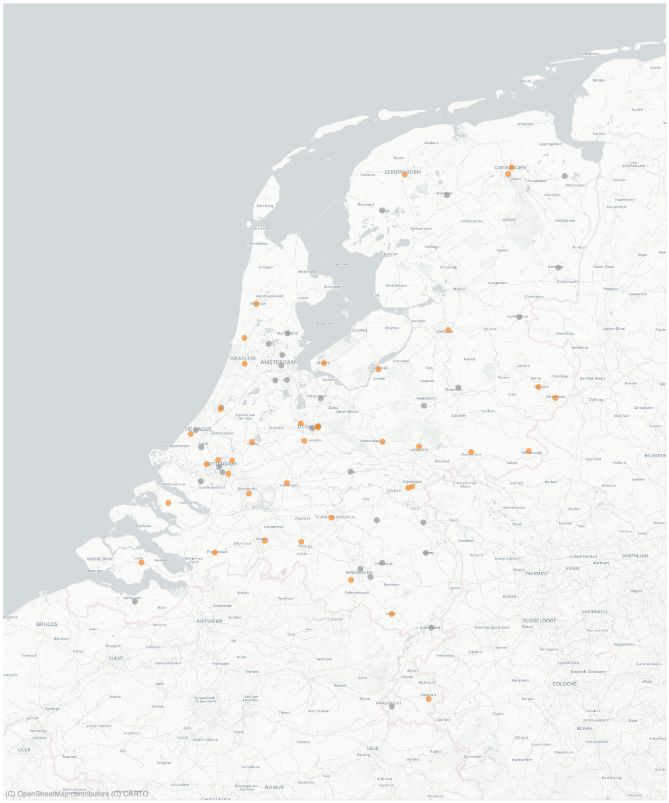

# _Solidair met onze gezondheidsdata, voor de zorg van morgen_

In Nederlandse ziekenhuizen is ontzettend veel waardevolle kennis aanwezig. Gegevens over behandelingen en uitkomsten kunnen ons helpen om de zorg van morgen te verbeteren. Maar hoe delen we deze inzichten zonder de privacy van patiënten in gevaar te brengen en zonder dat medische gegevens zomaar 'op straat' komen te liggen? Dat is waar **PLUGIN** voor staat.

## Wat is PLUGIN?
PLUGIN is een data infrastructuur van en vóór de Nederlandse ziekenhuiszorg. Het is een zogeheten **Health Data Space**: een veilige, digitale omgeving waarin zorgdata hergebruikt kan worden voor wetenschappelijk onderzoek, innovatie en beleid - ook wel secundair gebruik genoemd.

Het unieke aan PLUGIN is dat het een initiatief is van en vóór de zorg zelf, met een publiek karakter zonder winstoogmerk. Daarmee willen we waarborgen dat onze zorgdata op een solidaire en betrouwbare manier wordt hergebruikt en publieke, maatschappelijke waarde creëert.

### Hoe het werkt: data blijven zoveel als mogelijk bij de bron
Traditioneel worden voor hergebruik van gezondeheidsgegevens vaak kopieën van medische dossiers naar één centrale database gestuurd. Dat brengt veel risico's met zich mee. PLUGIN draait dit om. Wij werken volgens het principe dat **data bij de bron blijven**.

In plaats van de gegevens te verplaatsen naar de datagebruiker, brengen wij de onderzoeksvraag naar de data toe. De gegevens blijven veilig binnen de muren van het ziekenhuis staan. Onze technologie zorgt ervoor dat de analyse in het ziekenhuis zelf plaatsvindt en alleen de uitkomsten worden gedeeld. Een dergelijke manier van werken wordt ook wel *federatief analyseren* of *federatief leren* genoemd.

In het geval dat het niet anders kan, zoals bijvoorbeeld wanneer data verschillende zorginstellingen gecombineerd moeten worden of dat de data moeten worden opgenomen in een landelijke registratie, worden de data via het PLUGIN netwerk op een veilige manier doorgestuurd naar een centrale analyse omgeving.

### Eén centrale toegang tot data
Het PLUGIN‑datastation is de centrale ingang voor alle dataverzoeken binnen het ziekenhuis: van aanvraag tot analyse via één gestandaardiseerde route.
Juist door deze centrale toegang kan PLUGIN het principe van data bij de bron ondersteunen. Onderzoeksvragen worden gecontroleerd naar de juiste data gebracht, zonder dat gegevens onnodig verplaatst hoeven te worden. Zo maakt het datastation federatief analyseren in de praktijk uitvoerbaar en beheersbaar.

Daarmee ontstaat één eenduidige werkwijze in plaats van losse, parallelle oplossingen. Het datastation zorgt voor overzicht, controle en herbruikbaarheid, en maakt veilige en opschaalbare inzet van data mogelijk.

Tegelijkertijd bouwt het datastation voort op bestaande data‑ontsluitingssystemen binnen het ziekenhuis. In plaats van deze te vervangen, worden ze hergebruikt en verbonden tot één samenhangend geheel. Zo fungeert het als centraal knooppunt in de datastroom – het ‘hart van de zandloper’.

 
 

- <figure markdown="span">{ width=200 }</figure> PLUGIN ondersteunt [**datahouders**](./datahouder/index.md) in het veilig beschikbaar stellen van gezondheidsgegevens.

- <figure markdown="span">{ width=200 }</figure> PLUGIN ondersteunt [**datagebruikers**](./datagebruiker/index.md) met het hergebruik van data voor onderzoek, beleid en innovatie.

 

### Inmiddels hebben 36 ziekenhuizen een PLUGIN-datastation staan

<!-- 
 -->
  

    

    

    

      

        

          
        

        

          
        

        

          
        

        

          
        

        

          
        

        

          
        

        

          
        

        

          
        

        

          
        

        

          
        

        

          
        

        

          
        

        

          
        

        

          
        

        

          
        

        

          
        

        

          
        

        

          
        

        

          
        

        

          
        

        

          
        

        

          
        

        

          
        

        

          
        

        

          
        

        

          
        

        

          
        

        

          
        

        

          
        

        

          
        

        

          
        

        

          
        

        

          
        

        

          
        

        

          
        

        

          
        

        

          
        

      

    

  

<!-- 
 -->

---

 

### Wat doet PLUGIN concreet?
Wij leveren de diensten die nodig zijn om deze samenwerking mogelijk te maken. Dit doen we op drie niveaus:

* **Toezien op eerlijke spelregels:** Wij zorgen voor de spelregels, het toezicht en de centrale 'telefoonboek'-functie zodat onderzoekers en ziekenhuizen elkaar veilig kunnen vinden.
* **Ziekenhuizen helpen met het aansluiten op PLUGIN:** Wij ondersteunen ziekenhuizen bij de techniek om aan te sluiten en daarmee hun data op een gecontroleerde manier beschikbaar te stellen. We helpen met de installatie van de benodigde software. Daarnaast maken we de data geschikt voor hergebruik, door deze te transformeren naar gestandaardiseerde en machine-leesbare formaten.
* **Gebruikers helpen de data te gebruiken:** Wij bieden onderzoekers de gereedschappen om – zonder dat data het ziekenhuis verlaten – toch gedetailleerde analyses en specifieke berekeningen te doen op de gegevens. Zo zetten we data om in waardevolle inzichten voor de zorg.

PLUGIN organiseert niet alleen de technologie, maar ook de afspraken en processen die nodig zijn om data veilig en effectief te kunnen hergebruiken.

### PLUGIN is klaar voor de toekomst: de Europese context

De zorg houdt niet op bij de landsgrenzen. De Europese Unie werkt aan de **European Health Data Space (EHDS)**: een set nieuwe wetten en afspraken die het makkelijker moet maken om gezondheidsdata veilig te delen binnen Europa. Nederland bouwt hiervoor aan een Landelijk Dekkend Netwerk. PLUGIN is hier een onderdeel van: sinds 2022 werken wij met een partners uit het veld om dit te realiseren en bereiden we de functionaliteit en dekkingsgraad van PLUGIN steeds verder uit.

PLUGIN bereidt Nederlandse ziekenhuizen voor op deze toekomst. Wij zorgen dat de techniek en de afspraken zo zijn ingericht dat we straks naadloos en veilig kunnen aansluiten op dit Europese netwerk.

 

### PLUGIN voor open en solidair hergebruik van data

- :lucide-folder-code: __Gebouwd op open source__  [Lees meer :octicons-arrow-right-24:](community/ontwikkelaar.md)
- :lucide-signpost-big: __Een referentieimplementatie van data stations__  [Lees meer :octicons-arrow-right-24:](https://health-ri.github.io/data-station-specification/)

